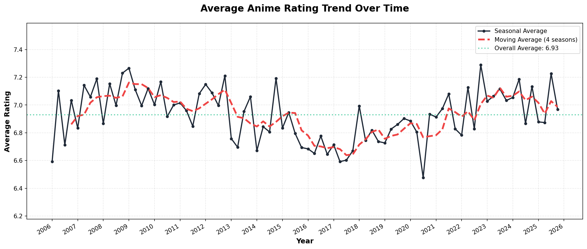
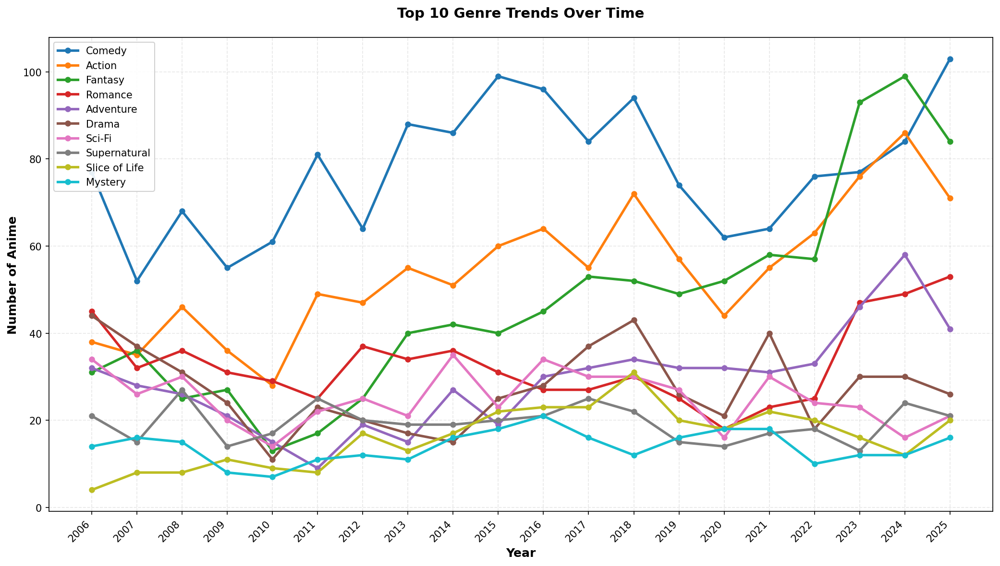
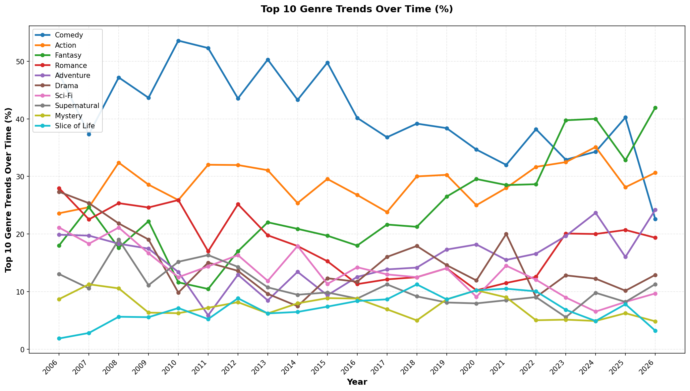
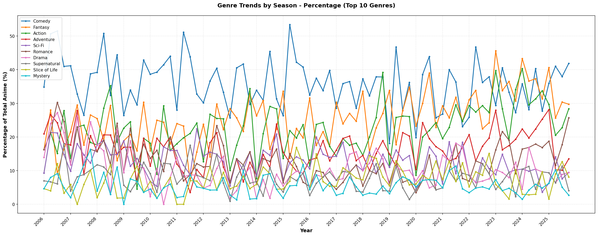
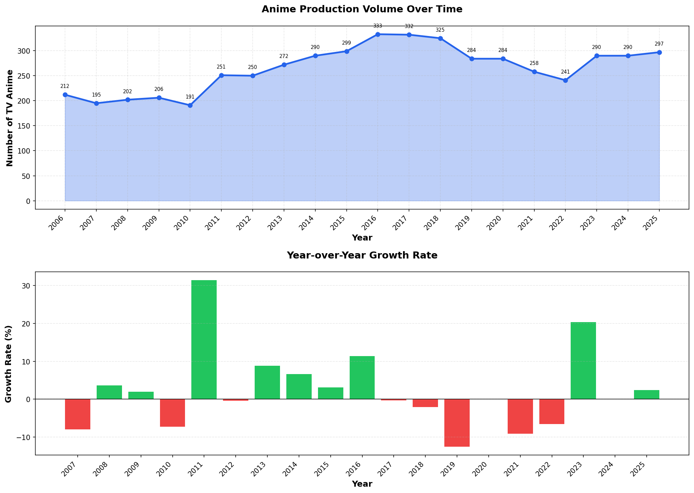
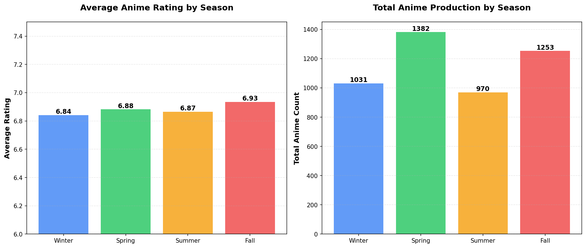
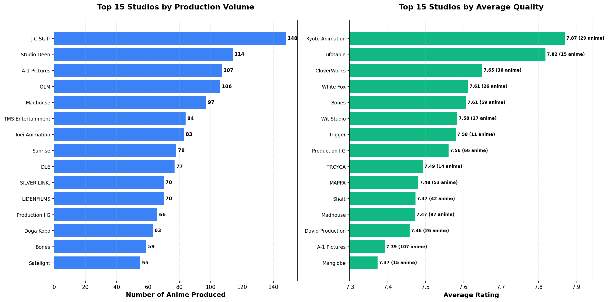
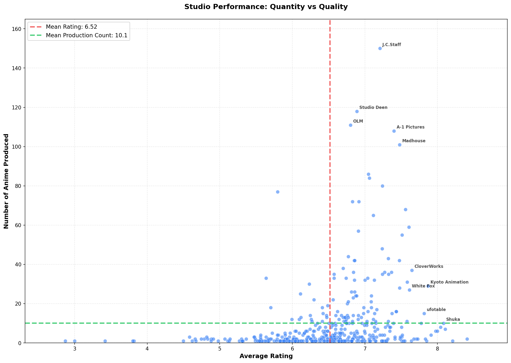
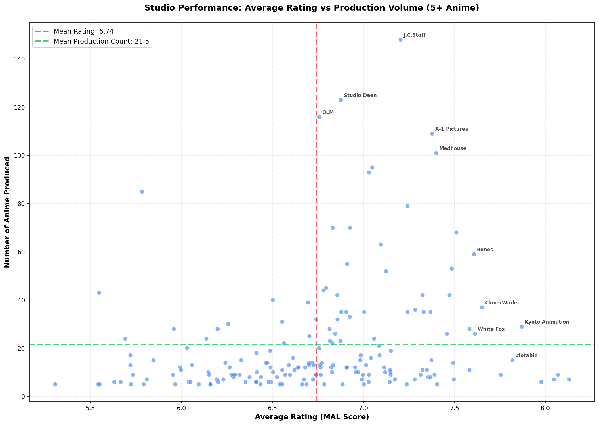
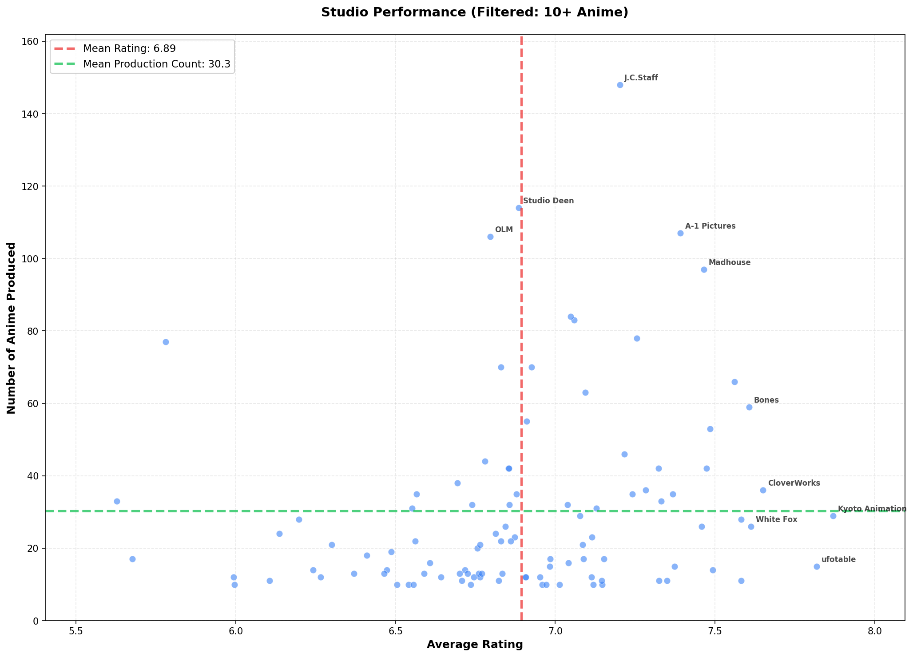

# 🎬 Anime Season Tracker

   


**Discover TV anime organized by year and season**

A beautiful, free anime tracker that helps you explore seasonal anime from 2006 onwards. Automatically updated weekly with the latest releases!

🌐 **Live Site**: [anime.ate329.com](https://anime.ate329.com)    

---

## ✨ Features

- 📅 **Browse by Season** - Explore anime from 2006 onwards
- 🎯 **Smart Filtering** - Genre filters with OR/AND logic
- 📊 **Rich Information** - Studios, ratings, synopses, themes, and more
- 📈 **Rating Trends** - Interactive graphs showing how ratings evolve over time
- 💫 **Modern Design** - Smooth animations and responsive layout
- 🔄 **Auto-Updated** - Weekly updates powered by GitHub Actions
- 🆓 **100% Free** - No ads, no tracking, no payments

---

## 🚀 How to Use

### Browse Anime
1. Visit the homepage
2. Scroll through available years (2006-2026)
3. Click on any season to view anime

### Filter Results
- **Adult Content Filter** - Toggle mature content visibility
- **Hide Not Rated** - Filter out unrated anime
- **Japanese Anime Only** - Show only Japanese productions
- **Genre Filters** - Select multiple genres with OR/AND logic

### Genre Filtering
- **OR Mode** (Default): Shows anime with *any* selected genre
- **AND Mode**: Shows anime with *all* selected genres

---

## 📂 Project Structure

```
anime-season-tracker/
├── index.html              # Main website
├── data.html               # Data visualization page
├── app.js                  # Frontend logic
├── fetch_anime.py          # Data fetching script
├── generate_graphs.py      # All graph generators (automated)
├── export_csv.py           # CSV export script
├── requirements.txt        # Python dependencies
├── README.md               # This file
├── data/                   # Anime data (JSON)
│   ├── manifest.json       # Index of all seasons
│   ├── rating-trend.json   # Rating trend data for web
│   ├── genre-trends.json   # Genre trends by year (absolute) for web
│   ├── genre-trends-percentage.json       # Genre trends by year (%) for web
│   ├── genre-trends-by-season.json        # Genre trends by season (absolute) for web
│   ├── genre-trends-by-season-percentage.json  # Genre trends by season (%) for web
│   ├── production-volume.json             # Production volume data for web
│   ├── seasonal-patterns.json             # Seasonal patterns data for web
│   ├── studio-rankings.json               # Studio rankings data for web
│   ├── studio-scatter.json                # Studio scatter plot data for web
│   ├── studio-scatter-filtered.json       # Studio scatter plot (5+ anime) for web
│   ├── studio-scatter-filtered-10.json    # Studio scatter plot (10+ anime) for web
│   ├── collection-stats.json              # Overall collection statistics
│   ├── csv/               # CSV exports for data analysis
│   │   ├── all_anime.csv                  # All anime with complete details
│   │   ├── ratings_by_season.csv          # Seasonal rating statistics
│   │   ├── genre_statistics.csv           # Genre stats and ratings
│   │   ├── studio_statistics.csv          # Studio stats and ratings
│   │   └── yearly_summary.csv             # Year-by-year summary
│   ├── 2006/
│   │   ├── winter.json
│   │   ├── spring.json
│   │   ├── summer.json
│   │   └── fall.json
│   ├── 2007/ ... 2026/    # More years
│   └── ...
├── assets/
│   ├── rating-trend.png   # Rating trend graph for README
│   ├── genre-trends.png   # Genre trends by year (absolute) for README
│   ├── genre-trends-percentage.png # Genre trends by year (%) for README
│   ├── genre-trends-by-season.png # Genre trends by season (absolute) for README
│   ├── genre-trends-by-season-percentage.png # Genre trends by season (%) for README
│   ├── production-volume.png # Production volume graph for README
│   ├── seasonal-patterns.png # Seasonal patterns graph for README
│   ├── studio-rankings.png # Studio rankings graph for README
│   ├── studio-scatter.png # Studio scatter plot graph for README
│   ├── studio-scatter-filtered.png # Studio scatter plot (5+ anime) for README
│   └── studio-scatter-filtered-10.png # Studio scatter plot (10+ anime) for README
└── .github/
    └── workflows/         # GitHub Actions
        ├── update-current-years.yml  # Weekly updates + graph
        └── update-all-years.yml      # Quarterly updates + graph
```

---

## 📊 Data Coverage

- **Years**: 2006 - now
- **Total Seasons**: 80+ seasons
- **Total Anime**: 4,000+ TV series
- **Updates**: 
  - Weekly: Current & next year
  - Quarterly: All historical data

---

## 📥 CSV Data Exports

All anime data is available in CSV format. [📖 View detailed CSV documentation →](data/csv/README.md)

### Available CSV Files:

1. **`all_anime.csv`** (4,500+ entries)
   - Complete dataset with all anime details
   - Includes: titles, scores, genres, studios, episodes, synopses, and more
   - Multi-value fields separated by `|` (genres, studios, themes, demographics)

2. **`ratings_by_season.csv`** (80+ entries)
   - Seasonal rating statistics from Winter 2006 onwards
   - Average, median, highest, and lowest scores per season

3. **`genre_statistics.csv`** (20+ entries)
   - Genre popularity and rating statistics
   - Total anime count and score metrics per genre

4. **`studio_statistics.csv`** (460+ entries)
   - Studio productivity and quality metrics
   - Total anime count and average ratings per studio

5. **`yearly_summary.csv`** (20 entries)
   - Year-by-year production statistics
   - Total anime, ratings, unique genres, and studios per year

---

## 📊 Data Insights & Trends

Explore fascinating insights into the anime industry with automatically generated visualizations!

### 📈 Average Rating Trend
How anime ratings have evolved over time - the average MyAnimeList rating for each season since 2006.



### 🎭 Genre Trends Over Time (By Year)
The top 10 most popular anime genres tracked annually - showing both absolute numbers and percentage of total production.

**Absolute Numbers:**



**Percentage of Production:**



### 🎭 Genre Trends Over Time (By Season)
The same top 10 genres tracked seasonally for more granular trend analysis - 4x more data points!

**Absolute Numbers:**


**Percentage of Production:**



### 📊 Production Volume
The total number of TV anime produced each year - tracking the industry's remarkable growth.



### 🗓️ Seasonal Patterns
Which season historically has the best ratings and most anime? Find out the patterns!



### 🏢 Studio Rankings
Compare the most prolific studios vs. the highest quality studios. Who makes the most anime? Who makes the best?



### 🎯 Studio Performance Analysis
Scatter plot showing the relationship between studios' average ratings and their production volume, with mean reference lines for both axes.



**Filtered View (5+ Anime):** More focused view showing only established studios:



**Filtered View (10+ Anime):** Even more focused on major studios:



> 💡 **Interactive versions** of all these graphs are available on the [Data page](https://anime.ate329.com/data.html)

---

## 🎯 What's Included

Each anime entry includes:
- Official titles (Japanese & English)
- Cover images
- Synopsis (with read more/less)
- MyAnimeList ratings and rating counts
- Production studios
- Source material (manga, light novel, etc.)
- Genres and themes
- Air dates
- Episode count
- Direct link to MyAnimeList

---

## 🔍 Data Source

All data comes from [MyAnimeList](https://myanimelist.net/) via the [Jikan API](https://jikan.moe/) - a free, unofficial MyAnimeList API.

**Note**: This tracker focuses exclusively on **TV series** (no movies, OVAs, or specials).

---

## 🗓️ To Do

- [ ] **🌏 Chinese Translation**
- [ ] **📡 RSS Support** - Subscribe to new anime releases
- [x] **Minor bug fixes** - Keep the button to MAL always at the bottom of the box
- [ ] **⭐ My Personal Recommendations** - :)
- [ ] **🔍 Search Functionality** - Search anime by title across all seasons
- [x] **🌙 Dark Mode** - Toggle between light and dark themes
- [ ] **📈 Trending** - See what's popular this season
- [ ] **🎲 Random Anime** - Discover new anime with random picker
- [ ] **📝 Notes** - Add personal notes to anime entries (maybe)

Feel free to contribute!

---

## ⚠️ Disclaimer

This project is not affiliated with or endorsed by MyAnimeList. All anime data, images, and information are property of their respective owners. This is a fan-made tool created for educational purposes.

---

## 🙏 Credits

- **Data**: [MyAnimeList](https://myanimelist.net/)
- **API**: [Jikan](https://jikan.moe/)
- **Design**: [Tailwind CSS](https://tailwindcss.com/)
- **Created by**: [@Ate329](https://github.com/Ate329)

---

## 📄 License

[MIT License](LICENSE) - Free to use and modify

---

**Enjoy discovering your next favorite anime!** 🎬✨
