# 🎬 Anime Season Tracker

**[中文](README_CN.md)** | **[English](README.md)**

   

一个美观、免费的动画追踪工具，帮助您探索 2006 年至今的季度动画。每周自动更新最新发布！

🌐 **网站**: [anime.ate329.com](https://anime.ate329.com)    

---

## ✨ 功能

- 📅 **按季节浏览** - 探索 2006 年至今的动画
- 🎯 **智能过滤** - 支持 OR/AND 逻辑的类型过滤
- 📊 **丰富信息** - 制作公司、评分、简介、主题等
- 📈 **评分趋势** - 交互式图表展示评分随时间的演变
- 💫 **现代设计** - 流畅动画和响应式布局
- 🔄 **自动更新** - 由 GitHub Actions 驱动的每周更新
- 🆓 **100% 免费** - 无广告、无追踪、无付费

---

## 🚀 如何使用

### 浏览动画
1. 访问主页
2. 滚动浏览可用年份（2006-2026）
3. 点击任意季节查看动画

### 过滤结果
- **成人内容过滤** - 切换成熟内容可见性
- **隐藏未评分** - 过滤未评分的动画
- **类型过滤** - 使用 OR/AND 逻辑选择多个类型

### 类型过滤
- **OR 模式**（默认）：显示具有*任意*所选类型的动画
- **AND 模式**：显示具有*所有*所选类型的动画

---

## 📂 项目结构

```
anime-season-tracker/
├── index.html              # 英文主页
├── index_cn.html           # 中文主页
├── data.html               # 英文数据可视化页面
├── data_cn.html            # 中文数据可视化页面
├── random.html             # 英文随机选择器
├── random_cn.html          # 中文随机选择器
├── app.js                  # 前端逻辑
├── data_cn.js              # 中文数据逻辑
├── fetch_anime.py          # 英文数据获取脚本（Jikan API）
├── fetch_bangumi.py        # 中文数据获取脚本（Bangumi）
├── generate_graphs.py      # 图表生成器（自动化）
├── export_csv.py           # CSV 导出脚本
├── requirements.txt        # Python 依赖
├── README.md               # 英文说明文档
├── README_CN.md            # 本文件
├── data/                   # 英文动画数据（JSON）
│   ├── manifest.json       # 所有季度的索引
│   ├── rating-trend.json   # 评分趋势数据
│   ├── genre-trends.json   # 类型趋势数据
│   ├── production-volume.json  # 产量数据
│   ├── csv/                # CSV 导出文件
│   ├── 2006/
│   │   ├── winter.json
│   │   ├── spring.json
│   │   ├── summer.json
│   │   └── fall.json
│   └── 2007/ ... 2026/     # 更多年份
├── data_cn/                # 中文动画数据（JSON）
│   ├── manifest.json       # 所有季度的索引
│   ├── rating-trend.json   # 评分趋势数据
│   ├── genre-trends.json   # 类型趋势数据
│   ├── 2024/
│   │   ├── winter.json
│   │   └── fall.json
│   └── ...
├── assets/                 # 英文图表资源
│   ├── rating-trend.png
│   ├── genre-trends.png
│   └── ...
├── assets_cn/              # 中文图表资源
│   ├── rating-trend.png
│   ├── genre-trends.png
│   └── ...
└── .github/
    └── workflows/          # GitHub Actions
        ├── update-current-years.yml   # 每周更新 + 图表
        └── update-all-years.yml       # 季度更新 + 图表
```

---

## 📊 数据覆盖

- **年份**: 2006 - 至今
- **总季度**: 80+ 季度
- **总动画**: 4,000+ 部 TV 系列
- **更新**: 
  - 每周：当前和下一年
  - 季度：所有历史数据

---

## 📥 CSV 数据导出

所有动画数据都可以 CSV 格式导出。[📖 查看详细 CSV 文档 →](data/csv/README.md)

### 可用的 CSV 文件：

1. **`all_anime.csv`** (4,500+ 条目)
   - 包含所有动画详细信息的完整数据集
   - 包括：标题、评分、类型、制作公司、集数、简介等
   - 多值字段用 `|` 分隔（类型、制作公司、主题、受众）

2. **`ratings_by_season.csv`** (80+ 条目)
   - 从 2006 年冬季开始的季度评分统计
   - 每季平均分、中位数、最高分和最低分

3. **`genre_statistics.csv`** (20+ 条目)
   - 类型流行度和评分统计
   - 每个类型的总动画数和评分指标

4. **`studio_statistics.csv`** (460+ 条目)
   - 制作公司生产力和质量指标
   - 每个制作公司的总动画数和平均评分

5. **`yearly_summary.csv`** (20 条目)
   - 逐年生产统计
   - 每年的总动画数、评分、独特类型和制作公司

---

## 📊 数据洞察与趋势

通过自动生成的可视化探索动画行业的迷人洞察！

### 📈 平均评分趋势
自 2006 年以来每季的平均 Bangumi 评分如何演变。

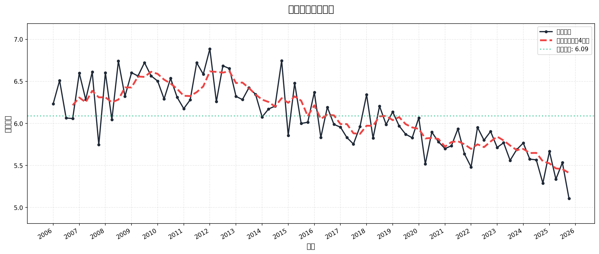

### 🎭 类型趋势（按年份）
按年跟踪最受欢迎的 10 个动画类型 - 显示绝对数量和占总产量的百分比。

**绝对数量：**

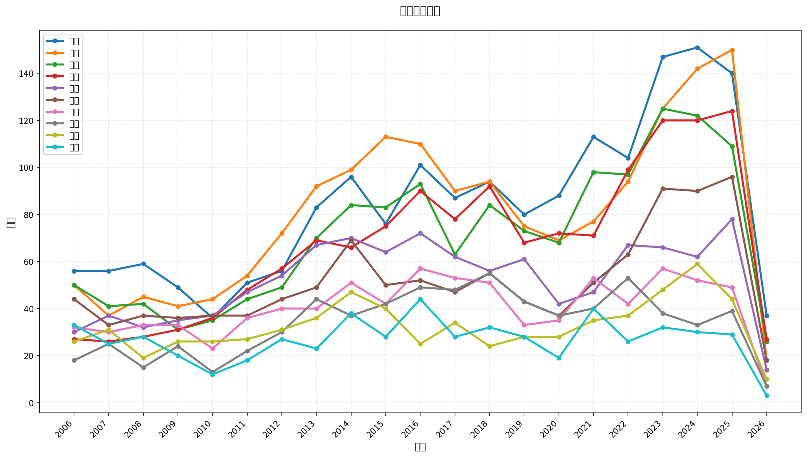

**产量百分比：**

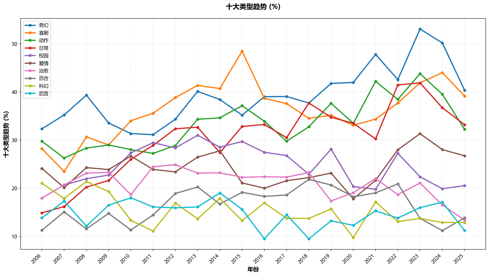

### 🎭 类型趋势（按季度）
按季跟踪相同的前 10 个类型以进行更细粒度的趋势分析 - 数据点多 4 倍！

**绝对数量：**

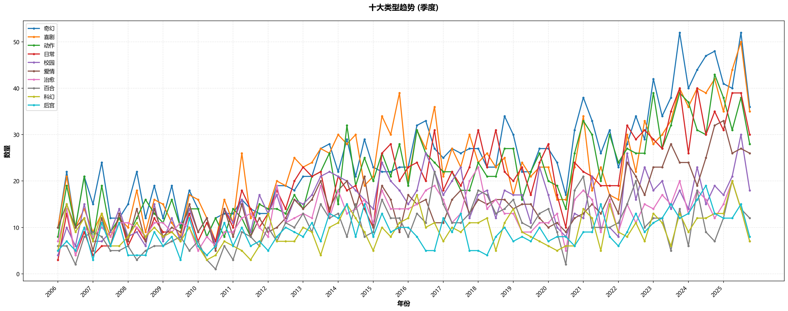

**产量百分比：**

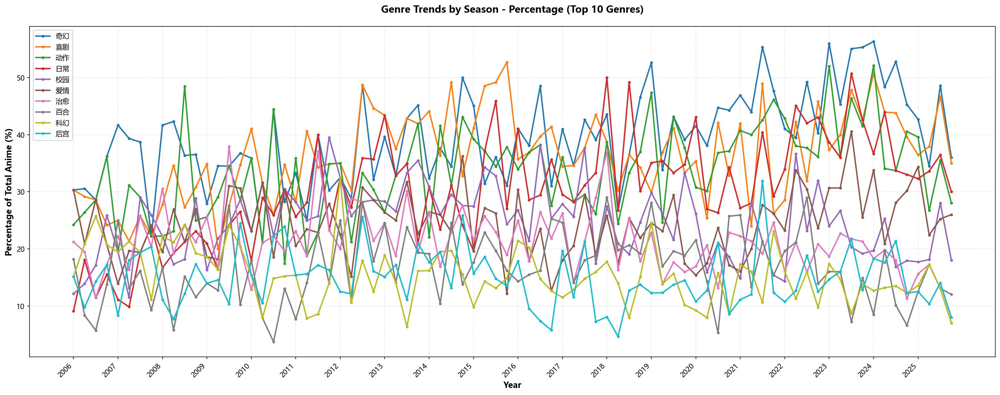

### 📊 产量
每年制作的 TV 动画总数 - 追踪行业的显著增长。

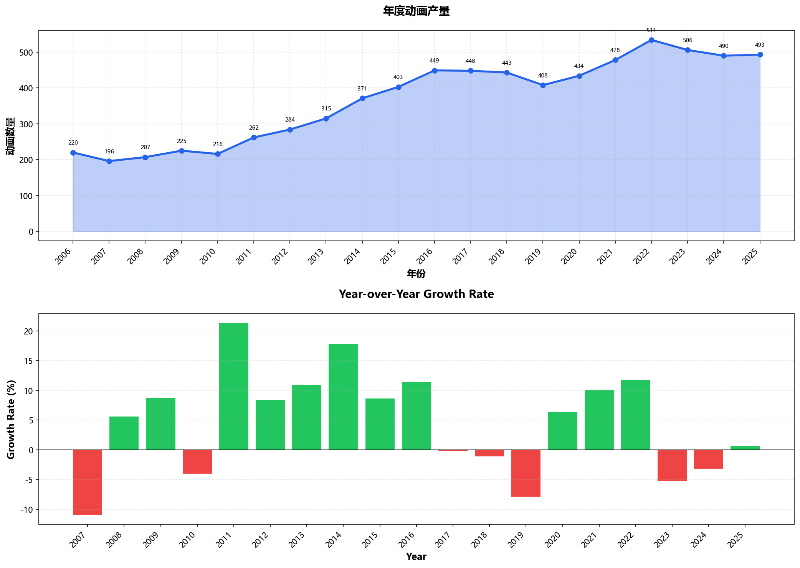

### 🗓️ 季节性模式
历史上哪个季节的评分最高、动画最多？找出模式！

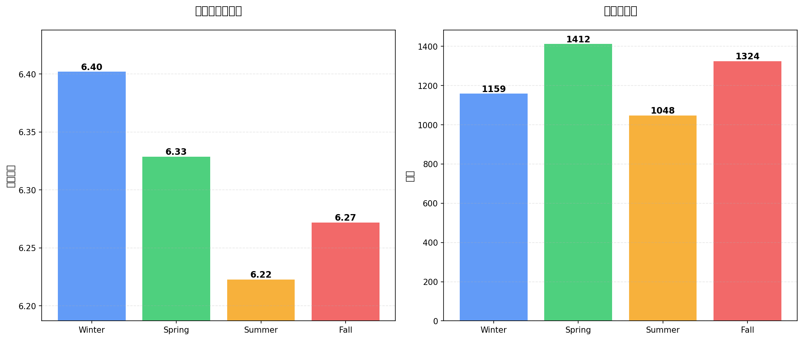

### 🏢 制作公司排名
比较最多产的制作公司和最高质量的制作公司。谁制作的动画最多？谁制作的最好？

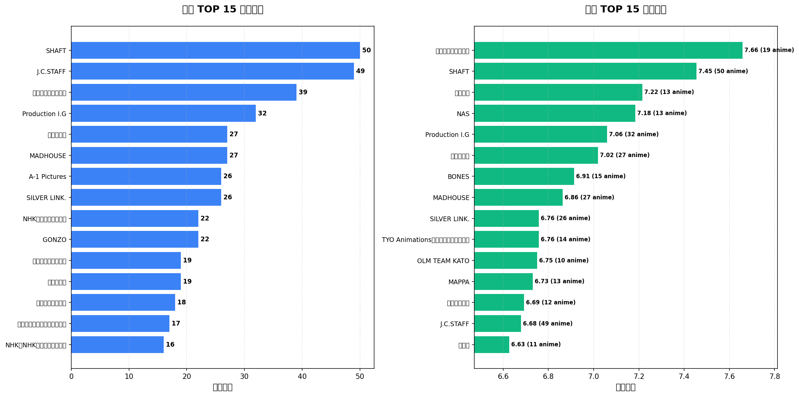

### 🎯 制作公司表现分析
散点图显示制作公司平均评分与产量之间的关系，两轴都有平均参考线。

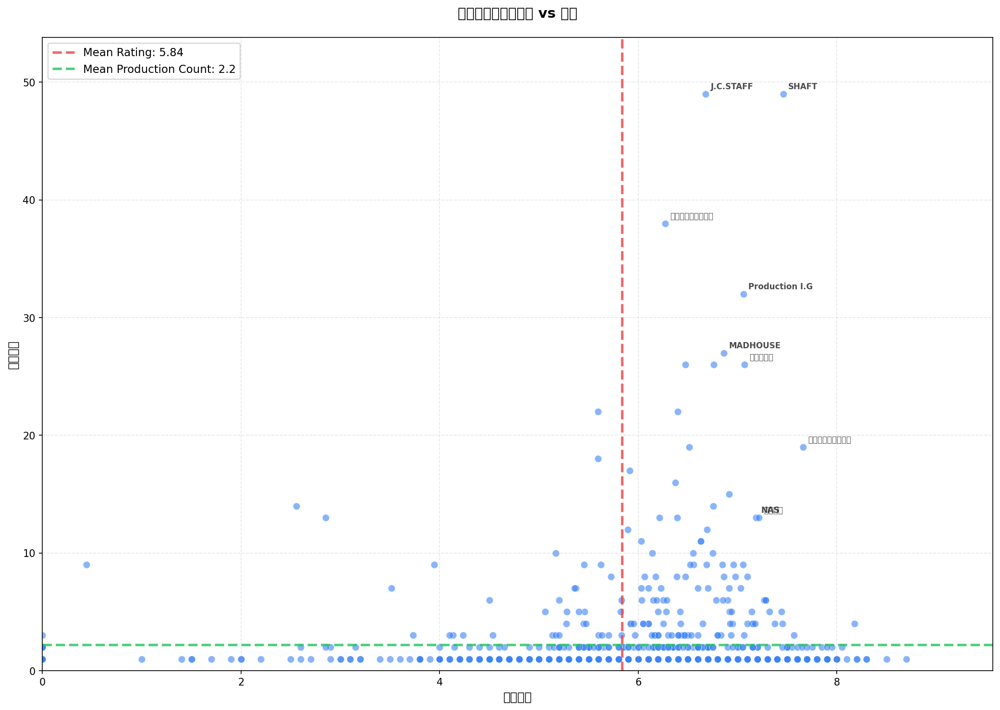

**筛选视图（5部以上）：** 更聚焦的视图，仅显示已有一定作品积累的制作公司：

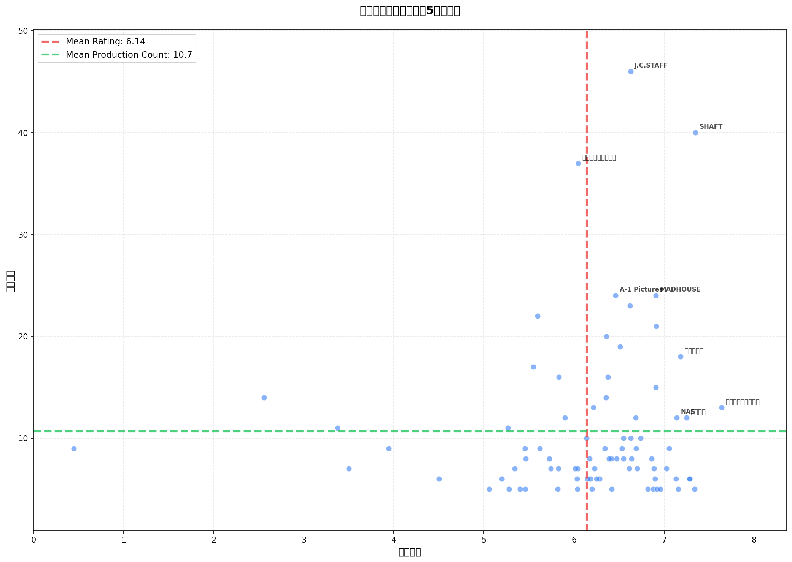

**筛选视图（10部以上）：** 更加聚焦于主要制作公司：

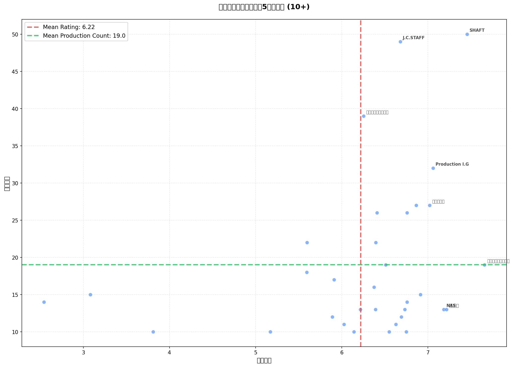

> 💡 所有这些图表的**交互版本**都可在[数据页面](https://anime.ate329.com/data_cn.html)上找到

---

## 🎯 包含内容

每个动画条目包括：
- 官方标题（日文和中文）
- 封面图片
- 简介（支持展开/收起）
- Bangumi 评分和评分人数
- 制作公司
- 来源素材（漫画、轻小说等）
- 类型和主题
- 播出日期
- 集数
- 直接链接到 Bangumi

---

## 🔍 数据源

### 中文版（本站点）
所有中文数据来自 [Bangumi 番组计划](https://bgm.tv/) - 一个中文 ACG 社区。

**注意**：中文版本专注于 **TV 系列**（不包括电影、OVA 或特别篇）。

### 英文版
英文数据来自 [MyAnimeList](https://myanimelist.net/) 通过 [Jikan API](https://jikan.moe/)。

> ⚠️ **重要提示**：由于数据源不同（Bangumi vs MyAnimeList），**中文版和英文版的数据不会完全相同**。两个数据库在评分、标签和动画列表方面可能存在差异。

---

## 🗓️ 待办事项

- [x] **🌏 中文翻译**
- [ ] **⭐ 我的个人推荐 :)**
- [ ] **📡 RSS 支持** - 订阅新动画发布
- [x] **🔍 搜索功能** - 在所有季度中按标题搜索动画
- [x] **🌙 暗黑模式** - 在明暗主题之间切换
- [x] **📈 趋势** - 查看本季的热门内容
- [x] **🎲 随机动画** - 使用随机选择器发现新动画

欢迎贡献！

---

## ⚠️ 免责声明

本项目不隶属于或得到 Bangumi 番组计划或 MyAnimeList 的认可。所有动画数据、图像和信息均为其各自所有者的财产。这是一个为教育目的创建的粉丝工具。

---

## 🙏 致谢

- **中文数据**: [Bangumi 番组计划](https://bgm.tv/)
- **英文数据**: [MyAnimeList](https://myanimelist.net/)
- **API**: [Jikan](https://jikan.moe/)
- **设计**: [Tailwind CSS](https://tailwindcss.com/)
- **创建者**: [@Ate329](https://github.com/Ate329)

---

## 📄 许可证

[MIT License](LICENSE) - 免费使用和修改

---

**享受发现您的下一部最爱动画！** 🎬✨
